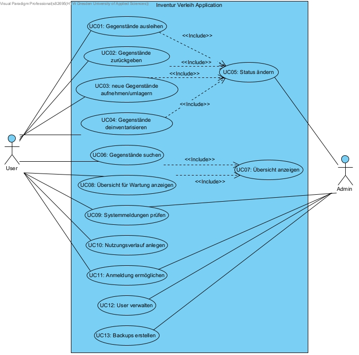

= Anforderungsspezifikationen

== Einführung
Der Zweck dieses Dokuments ist es, die wesentlichen Bedarfe und Funktionalitäten des digitalen Inventur- und Verleihsystems zu sammeln, zu analysieren und zu definieren. Der Fokus liegt auf den Fähigkeiten, die von Stakeholdern und adressierten Nutzern benötigt werden, und der Begründung dieser Bedarfe. Die  Details, wie das digitale Inventur- und Verleihsystem diese Bedarfe erfüllt, werden in der Use-Case und Supplementary Specification beschrieben.

=== Zweck
Der Zweck dieses Dokuments ist es, die wesentlichen Anforderungen an das System aus Sicht und mit den Begriffen der künftigen Anwender zu beschreiben.

=== Gültigkeitsbereich (Scope)
Dieses Visions-Dokument bezieht sich auf das digitale Inventur und Verleih System, das von Team I6 entwickelt wird. Das System wird es der HTW Arbeitsgruppe für Smart Production Systems erlauben, Ausleihen und zurückgeben von Gegenständen zu dokumentieren, Benutzer im System anzulegen und desen Rechte zu bearbeiten, sich per Login zu authentifizieren und Backups anzulegen, um damit eine strukturierte Inventarverwaltung zu erreichen und Wartungen besser zu planen.

=== Definitionen, Akronyme und Abkürzungen
[%header]
|===
| Begriff | Definition und Erläuterung | Synonyme
//| Kommissionierung | Bereitstellung von Waren aus einem Lager entsprechend eines Kundenauftrags | (keine)

| Administrator
| Kann Anwender anlegen, bearbeiten und löschen.
| Admin

| Anwender
| Kann Lager einsehen, Zustand und Status des Inventars auslesen, Inventar ausleihen und zurückgeben.
| User

| Status
| Beschreibt den Verfügbarkeitszustand eines Gegenstandes. +
Kann die Werte verfügbar, ausgeliehen, in Wartung annehmen.
Oder beschreibt den Verfügbarkeitszustand eines Lagerfachs. Kann die Werte Gegenstand in diesem Fach wurde ausgliehen, Gegenstand befindet sich in diesem Fach, leer annehmen. 
| Zustand

| Rechte
| Regelt die verschiedenen Ebenen und Vererbungen diverser Rechte zum Anlegen, ändern und löschen des Inventars
| Userrechte, Anwenderrechte

| Gegenstand
| Gekennzeichnet durch eine eindeutige Nummer.
| Objekt

|Anmeldung
|... ist der Vorgang der Authentifizierung durch Benutzernamen und Passwort.
|Login

|===

.benutzte Abkürzungen
[%header]
|===
| Abkürzung | Bedeutung | Erläuterung
| UP | Unified Process | Vorgehensmodell für die Softwareentwicklung
| AG SPS | Arbeitsgruppe Smart Production Systems | Unser Auftraggeber, Kunde oder Themenersteller
| HTW | Hochschule für Technik und Wirtschaft Dresden | Übergeordente Institution in welcher unsere Anwendung laufen soll
|===

== Verzeichnis der Datenstrukturen
[%header]
|===
| Bezeichnung | Definition | Format | Gültigkeitsregeln | Aliase

| Anmeldedaten
| Zusammensetzung von Benutzername und Passwort.
| JSON
| Emailadresse muss `@`-Zeichen und `.` Punkt enthalten. +
Mindestlänge Passwort 8 Zeichen.
| Login

| Eigenschaften von Objekten (Frontend)
| id: number; +
sectionId: number; +
sectionName: string; +
storageId: number; +
storageName: string; +
roomId: number; +
roomName: string; +
name: string; +
isbn: number; +
state: ObjectState; +
lendBy: String; +
cond: number; +
lendDate: Date
| JSON
| Muss die angegebenen Datentypen besitzen.
| Object
|===

== Positionierung

=== Fachliche Motivation

Unser fachliche Motivation besteht darin, der AG SPS die Lagerhaltung zu vereinfachen und den unnötigen Mehraufwand einer Excel-Liste zu vermeiden. Mit einer Web-basierten Anwendung erhoffen wir uns Redundanzen zu vermeiden und Speicherprobleme zu eleminieren.

=== Problem Statement

[cols="1,3"]
|===
| Das Problem | die Lagerverwaltung und Inventarisierung der SPS
| betrifft | Arbeitsgruppe Smart Production System
| die Auswirkung davon ist | umständliche und aufwändige Lagerhaltung mit Hilfe einer Excel Liste
| eine erfolgreiche Lösung wäre | eine webbasierte Anwendung für die vereinfachte Lagerverwaltung geräteunabhängig zu realisieren
|===

=== Positionierung des Produkts
[cols="1,3"]
|===
| Für
| HTW Smart Production Systems

| der / die
| verbesserte Inventarverwaltung mit Ausleihsystem

| Das Produkt / die Lösung ist eine
| Datenbankanwendung

| Die / Das
| Finden von verfügbaren und dem Gegenstand entsprechenden Lagerplätzen.

| Im Gegensatz zu
| einer Excel-Tabelle

| Unser Produkt
| ist strukturiert, modular aufgebaut, besitzt eine User- und Rechteverwaltung und es erlaubt parallelen Zugriff.
|===

== Stakeholder Beschreibungen

=== Zusammenfassung der Stakeholder

[%header, cols="1,3,3"]
|===
| Name | Beschreibung | Verantwortlichkeiten

| HTW Smart Production Systems
| Auftraggeber
| - erteilen einer präzise Aufgabenstellung +
- überprüfen, ob Lösungsvorschläge mit Erwartungen übereinstimmen

| HTW Rechenzentrum / Server Informatik/Mathematik
| stellt Betriebsumgebung
| - Bereitstellung der VM - Regelung zum Betrieb der VM - Bereitstellung/Betrieb Intranet

| Gesetzgeber 
| gibt rechtliche Rahmenbedingungen vor,
z.B. durch Gesetze für Datenschutz und Lagerung von Gefahrstoffen
| überwacht Gesetze und Regelungen
hinsichtlich des Umgang mit
personenbezogenen Daten und Gefahrstoffen

| Anwender (User)
| Jeder Mitarbeiter der als User im System Registriert ist
| Einfache Ausleihe / Rückgabe von Gegenständen

|===

=== Benutzerumgebung
. Der Benutzer steht im Lager, welches durch unterschiedliche Schränke, Fächer und Lagerflächen organisiert ist.
. Alle Gegenstände im Lager besitzen einen eindeutigen Barcode (entweder bereits von Werk aus vorhanden oder selbst ertellt), der mit einem mobilen Endgerät eingelesen werden kann.
. Manche Gegenstände, insbesondere welche mit Akkumulatoren oder Verbrauchsmitteln, müssen in regelmäßigen Abständen zur Wartung.
. Der Benutzer hat ein mobiles Endgerät (bspw. Smartphone, Tablett) zur Verfügung.
. Die Verbindung zum System wird per drahtloser Datenverbindung (eduroam WLAN) hergestellt. Dabei könnte das Problem auftreten, dass der Benutzer schlechten oder gar kein WLAN empfang hat.
. Alternative kann auch ein Desktop PC mit LAN-Anschluss genutzt werden.
. Eine Internetverbindung ist zur Nutzung des Systems zwingend erforderlich.

== Produkt-/Lösungsüberblick

[%header, cols="4,1,4,1"]
|===
| Bedarf | Priorität | Features | Geplantes Release
| keine schnelle, aussagekräftige, zentrale Übersicht über alle Gegenstände vorhanden, die von überall aus abrufbar ist
| hoch
| strukturierte Anzeige mit Lagerplatz/Status aller Gegenstände
| 01.06.2022

| zentrales, einfaches und übersichtliches Hinzufügen von Gegenständen ins Inventar nicht möglich 
| hoch
| über Suche nach leerem Lagerplatz, Eingabe von Gegestands Daten neue Gegenstände zum Inventar hinzufügbar
| 01.06.2022

| Unübersichtlichkeit wer welche Gegenstände zu welchem Zeitpunkt ausleiht, zurückgibt 
| mittel
| Authentifikation der Client per Login, Sichere Datenübermittlung
| 01.06.2022

| Webseitenansicht im Querformat
| mittel
| Webseitenansicht für Mobile Geräte Optimiert (Hochkant, große Buttons)
| 01.06.2022

| Unübersichtliches, umständliches Suchen und Ausleihen der Geräte 
| hoch
| vereinfachtes Ausleihen der Gegenstände über suchen und Status ändern
| 01.06.2022

| Unübersichtliches, umständliches Suchen und Zurückgeben der Geräte 
| mittel
| vereinfachte Rückgabe der ausgeliehenen Gegenstände über Eingabe der ID -> Anzeige Lagerort, Status ändern 
| 01.06.2022

| Falls Exceltabelle verloren geht, besteht wenig Chance auf Wiedererlangung, außerdem keine älteren Datenstände (Versionen) abrufbar
| niedrig
| Erstellung von Backups durch Kopieren der Datenbank
| 01.06.2022

|===

[%header, cols="4,1,1"]
|===
| Anforderung | Priorität | Geplantes Release
|einfache Bedienbarkeit mittels GUI| hoch | Sommersemester 2022

|System kann nur online im HTW-Netz genutzt werden (nicht offline/ außerhalb) | mittel | 04.06.2022

|System muss auf allen gängigen Browsern sowie auf mobilen
Endgeräten lauffähig sein | mittel | Sommersemester 2022

| Software muss modular aufgebaut sein | mittel | Sommersemester 2022

| Einsatz eines relationales Datenbankmodell | hoch | 14.05.2022
|===

== Identifizierte Use Cases
// Liste aller identifizierten Use Cases (priorisiert)
*für Akteur User:*

* *UC01*: Gegenstände ausleihen 
* *UC02*: Gegenstände zurückgeben 
* *UC03*: neue Gegenstände aufnehmen
// und leeres Fach finden
* *UC04*: Gegenstände deinventarisieren 
* *UC05*: Status manuell ändern
* *UC06*: Gegenstände suchen
* *UC07*: Übersicht anzeigen
* *UC08*: Übersicht für Wartung anzeigen
* *UC09*: Systemmeldungen prüfen
* *UC10*: Nutzungsverlauf anlegen
* *UC11*: Anmeldung ermöglichen
* *UC12*: User verwalten
* *UC13*: Backup erstellen
//* *UC12*: User anlegen
//* *UC13*: Userrechte bearbeiten
//* *UC14*: User bearbeiten
//* *UC15*: User löschen
//* *UC16*: Backup erstellen

//*Allgemein*

//* *UC17*: Authentifikation der Clients
//* *UC18*: Verschlüsselung der Kommunikation zwischen DB und WebAnwendung

== Use Case Diagramm

//Fügen Sie nachfolgend alle detailierten Use-Cases per Include ein.
//Dafür sollten Sie pro Use-Case eine Datei anlegen, die auf dem use_case_01.inc.adoc Template basiert.
<<<
include::../docs/requirements/use_case_01.inc.adoc[]
<<<
include::../docs/requirements/use_case_02.inc.adoc[]
<<<
include::../docs/requirements/use_case_03.inc.adoc[]
<<<
include::../docs/requirements/use_case_04.inc.adoc[]
<<<
include::../docs/requirements/use_case_05.inc.adoc[]
<<<
include::../docs/requirements/use_case_06.inc.adoc[]
<<<
include::../docs/requirements/use_case_07.inc.adoc[]
<<<
include::../docs/requirements/use_case_08.inc.adoc[]
<<<
include::../docs/requirements/use_case_09.inc.adoc[]
<<<
include::../docs/requirements/use_case_10.inc.adoc[]
<<<
include::../docs/requirements/use_case_11.inc.adoc[]
<<<
include::../docs/requirements/use_case_12.inc.adoc[]
<<<
include::../docs/requirements/use_case_13.inc.adoc[]

== Systemweite funktionale Anforderungen
//Angabe von system-weiten funktionalen Anforderungen, die nicht als Use Cases ausgedrückt werden können. Beispiele sind Drucken, Berichte, Authentifizierung, Änderungsverfolgung (Auditing), zeitgesteuerte Aktivitäten (Scheduling), Sicherheit / Maßnahmen zum Datenschutz

- *SWFR-1: Das System muss alle Inventar-, Ausleih- und Benutzerdaten persistent speichern.* +
Test: Die Datenbank(en) wird/werden mit Testdaten gefüllt. Anschließend wird das System aus­-
geschaltet. Die Daten müssen bei Wiederinbetriebnahme vollständig vorhanden sein.

- *SWFR-2: Die Kommunikation zwischen Clients und Server muss verschlüsselt sein.* +
Test: Vorhandensein von (TLS) Bei einem MitM-Angriff dürfen keine Daten in Klartext lesbar sein.

- *SWFR-3: Nach dem Aufrufen der Anwendung müssen sich die Clients/User am Server durch die Eingabe von Benutzernamen und Passwort authentifizieren.* +
Test: Werden Security-Token verwendet, ist dies sicher gegen Session-Hijacking?

- *SWFR-4: Die Daten müssen auf dem Server vor unberechtigten Zugriff geschützt sein.* +
Test: Das Ausführen von SQL-Injections darf nicht möglich sein.

- *SWFR-5: Die Passwörter der Useraccounts müssen sicher und verschlüsselt in der Datenbank gespeichert werden.* +
Test: in der Datenbank nach Passwörtern suchen (sollten nicht in Klartext zu finden sein)

== Qualitätsanforderungen für das Gesamtsystem
//Qualitätsanforderungen repräsentieren das "URPS" im FURPS+ zu Klassifikation von Anforderungen

=== Benutzbarkeit (Usability)
//Beschreiben Sie Anforderungen für Eigenschaften wie einfache Bedienung, einfaches Erlernen, Standards für die Benutzerfreundlichkeit, Lokalisierung (landesspezifische Anpassungen von Sprache, Datumsformaten, Währungen usw.)
- *NFRU-1: Die Sprache der Benutzeroberfläche ist Englisch.*
- *NFRU-2: Die Startseite soll alle möglichen Aktionen anzeigen, für die der Benutzer die Rechte hat.* +
Test: Unterschiedliche Personen (Admin/ normaler Benutzer) werden unterschiedliche Aktionen auf der Startseite angezeigt. 
- *NFRU-3: Die Eingaben bei der Suchfunktion werden durch Vorschläge unterstützt.* + 
Test: Eingabe von nur den ersten 3 Buchstaben eines Gegenstandes in die Suchfunktion. Es wird überprüft, ob der vollständige Name des Gegenstandes angezeigt wird. 
// Frage: ist das zu viel Arbeit? wollen wird so was überhaupt? 
- *NFRU-4: Es werden pro Ansicht nur 6 Gegenstände angezeigt.* +
// um eine Touchbedienung z.B. auf dem Smartphone zu ermöglichen 
Test: Es werden mindestens 7 Gegenstände im System eingeführt. Es wird überprüft, wie viele Gegenstände auf der Ansicht dargestellt werden. 
- *NFRU-5: Ein Gegenstand, der sich im System befindet, soll mit 5 Klicks oder weniger ausgeliehen oder zurückgegeben werden können.* + 
Test: Unterschiedliche Gegenstände werden ausgeliehen oder zurückgegeben und die Klicks werden gezählt. 
- *NFRU-6: Alle im System befindlichen Daten (Rückgabedatum, Wartungsdatum etc.) sollen in folgendem Format angezeigt werden: DD.MM.JJJJ.* +
Test: Es werden einige Anwendungsfällen mit Datumseingabe, durchgeführt. Anschließend wird kontrolliert, ob das System das Datum im richtigen Format gespeichert hat. 
- *NFRU-7: Die Gegenstände müssen über einen Barcode gefunden werden können.* + 
Test: Ein Objekt durch scannen eines Barcodes finden.

=== Zuverlässigkeit (Reliability)

- *NFRR-1: Es darf kein falscher Benutzername oder falsches Passwort angegeben werden.* +
Test: Zur Überprüfung wird getestet, ob in diesen Anwendungsfällenin entsprechender Hinweistext angezeigt wird.

- *NFRR-2: Ein neuer Benutzername darf keinen bereits vergebenen Namen erhalten.*

- *NFRR-3: Alle Daten müssen in der Datenbank konstistent nach dem ACID-Prinzip gespeichert werden.* +
Test: Überprüfung auf Inkonsistenz der Daten.

- *NFRR-4: Das System sollte eine Verfügbarkeit von 95% gewährleisten.* +
Test: System gezielt zum Absturz bringen, Zeit bis System wieder verfügbar messen

=== Effizienz (Performance)

- *NFRP-1: 10 User müssen gleichzeitig das System nutzen können.* +
Test: Mehr Nutzerzugriffe gleichzeitig ausführen.

=== Wartbarkeit (Supportability)

- *NFRS-1: Vorliegen einer Bedienungsanleitung* +
Test: Ausführen/Starten des Servers von einer projektfremden Person.

== Zusätzliche Anforderungen

=== Einschränkungen
//Angaben ergänzen, nicht relevante Unterpunkte streichen oder auskommentieren
Unsere Anwendung besteht aus 2 Teilen, dem Frontend und dem Backend. 
Für das Entwickeln des Backends nutzen wir das SpringBoot Framework, da unser Team bereits einige Vorerfahrungen dazu hat und die Anbindung und Verwendung einer Datenbank damit einfach und flexibel ist.
Für das Frontend verwenden wir die ReactJS Bibliothek, da diese eine Vielzahl von schönen Nutzerelementen mit verschiedenen Animationen und Layouts bereitstellt.

== Organisatorische Randbedingungen
//Angaben ergänzen, nicht relevante Unterpunkte streichen oder auskommentieren
* Das System muss von geschultem Personal gepflegt und gewartet werden.
* Neue User sollten mit der Software vor der ersten Nutzung vertraut gemacht werden.
* Die Software ist nur in englischer Sprache gehalten.

== Rechtliche Anforderungen
//Angaben ergänzen, nicht relevante Unterpunkte streichen oder auskommentieren
* Die Lizensierung der Anwendungen wird vorausgesetzt.
* Die Einhaltung der DSGVO wird vorausgesetzt und ist vom Anwender zu prüfen.
* Der Urheberrechtsschutz muss vom Anwender gewährleistet werden.

* Das Produkt steht unter der MIT-Lizenz:
        
        Urheberrecht (c) 2022 I6 Inventur Verleih

        Hiermit wird jeder Person, die eine Kopie dieser Software und der zugehörigen Dokumentationsdateien (die "Software") erhält, die kostenlose Erlaubnis erteilt,    diese Software und die zugehörigen Dokumentationsdateien (die "Software"), die Software ohne Einschränkung zu vertreiben, einschließlich und ohne Einschränkung der Rechte sie zu nutzen, zu kopieren, zu modifizieren, zusammenzuführen, zu veröffentlichen, zu vertreiben, zu unterlizenzieren und/oder zu verkaufen, vorbehaltlich der folgenden Bedingungen:
        
        Der obige Copyright-Hinweis und dieser Genehmigungshinweis müssen in allen Kopien oder wesentlichen Teilen der Software enthalten sein.
        
        DIE SOFTWARE WIRD "WIE BESEHEN" BEREITGESTELLT, OHNE JEGLICHE, AUSDRÜCKLICHE ODER STILLSCHWEIGENDE GEWÄHRLEISTUNG, EINSCHLIESSLICH, ABER NICHT BESCHRÄNKT AUF DIE GEWÄHRLEISTUNG DER MARKTGÄNGIGKEIT,
        EIGNUNG FÜR EINEN BESTIMMTEN ZWECK UND NICHTVERLETZUNG VON RECHTEN DRITTER. IN KEINEM FALL SIND DIE AUTOREN ODER URHEBERRECHTSINHABER HAFTBAR FÜR JEGLICHE ANSPRÜCHE, SCHÄDEN ODER ÄHNLICHES, OB AUS VERTRAG, DELIKT ODER ANDERWEITIG ENTSTEHEND AUS ODER IM ZUSAMMENHANG MIT DER SOFTWARE, DER VERWENDUNG ODER ANDEREN HANDLUNGEN MIT DER SOFTWARE.

