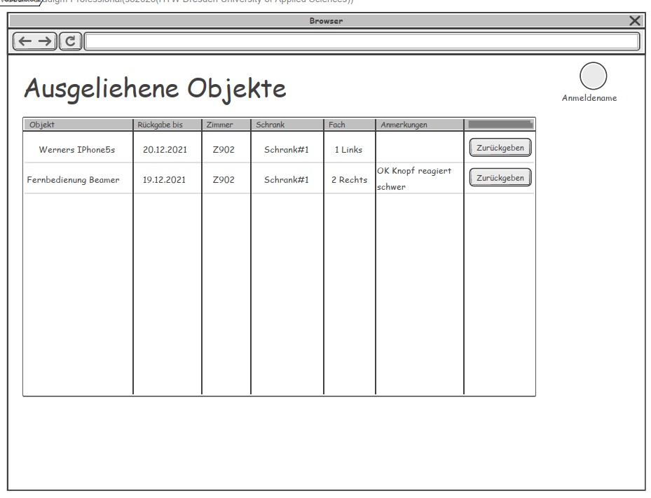
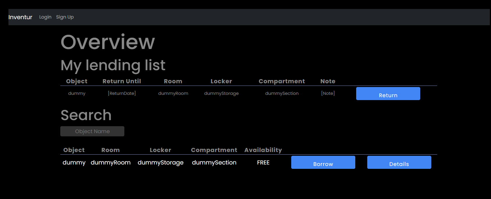
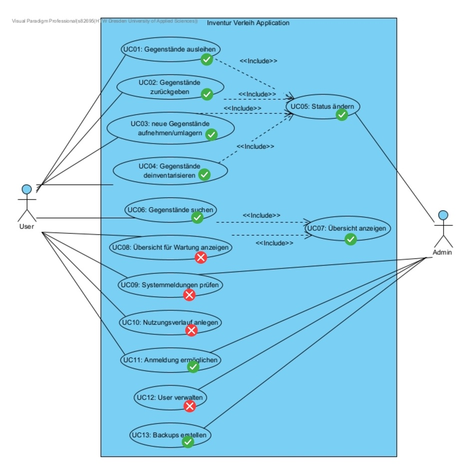

:docs: ../docs

include::../docs/_includes/default-attributes.inc.adoc[]

:doctype: book
:toc:
:toclevels: 3
:toc-title: Inhaltsverzeichnis
:sectnums:
:icons: font
:source-highlighter: highlightjs
:source-highlighter: rouge
:rouge-style: github
:xrefstyle: full
:experimental:
:chapter-label:
:figure-caption: Abbildung
:table-caption: Tabelle
:listing-caption: Listing
:!example-caption:
:experimental:

= *Projektbericht* Inventur- und Verleihsoftware (I6) 
Fabian Krähmer, Silko Grellmann, Felix Helmert, Nico Papke, Moritz Lehmann, Dominique Linzmajer
08. Juli 2022

== Inventur Verleih - Digitale Inventur- und Verleihliste (I6)
Dies ist der Projekt Bericht des Themas I6: Digitale Inventur- und Verleihliste. Das Projekt wurde im Wintersemester 2021/2022 und Sommersemester 2022 bearbeitet. Der Projektbericht entstand als Gruppenarbeit aller Teammitglieder. Hierfür wurde ein Pull Request im GitHub geöffnet an dem parallel gearbeitet werden konnte.

|===
|*Namen* | *verwendete Namenskürzel*
|Fabian Krähmer | FK
|Silko Grellmann | SG
|Dominique Linzmajer| DL
|Felix Helmert| FH
|Moritz Lehmann| ML
|Nico Papke| NP
|===

== Planung 
=== Ausgangssituation in SE II [FK]
==== Teamaufstellung
Am Anfang des Projekts bestand das Team aus acht Mitgliedern. Anja Claus, Felix Helmert, Jamal Alkharrat, Dominique Linzmajer, Jonas Koloska, 
Moritz Lehmann und Silko Grellmann. Geplant war das Ausscheiden von Anja Claus zu SE II, jedoch wurde unser Team leider zusätzlich von Jonas Koloska und Jamal Alkharrat verlassen. Deshalb wurde uns Nico Papke zur Verstärkung zugewiesen. Dadurch haben wir zu Beginn von SE II eine neue Einteilung der Rollen des Teams durchgeführt. Mehr dazu findet man in der Rollenverteilung.

==== Aufgabenstellung und Auftraggeber
Das Hauptziel unseres Projekts war es eine Digitale Inventur- und Verleihliste zu entwickeln.
Zudem erlaubt eine digitale Dokumentation eine bessere Qualitätssicherung, bzw. ermöglicht diese 
erst. Mit den erfassten Ein- und Auslagerungsprozessen kann eine Historie eines Gegenstandes erzeugt 
werden, wodurch sich zum Beispiel Szenarien aus dem Bereich der vorausschauenden Wartung 
realisieren lassen. Wartungsintervalle von Werkzeugen (mechanischer Verschleiß, das Wechseln von 
Batterien oder Nachfüllen von Verbrauchsmaterialen) könnten so ihren statischen Charakter verlieren 
und sich stattdessen an der realen (Ab-)Nutzung orientieren. 

Unser Auftraggeber, die Arbeitsgruppe Smart Production Systems (kurz AG SPS) der HTW Dresden hatte bei Erstgespräch einen groben Plan wie die Umsetzung aussehen sollte, jedoch ohne nennenswerte Systemeinschränkungen, sodass wir uns in Programmierart und Sprache frei entfalten konnten.

Im weiteren Gespräch mit den Auftraggebern, stellten sich schnell die wichtigsten Aspekte des Systems heraus.
Es sollte möglichst einfach zu bedienen sein, hochverfügbar und von jedem Gerät zu steuern sein. 
Wichtig war dabei ebenfalls, dass das System nur intern verwendbar ist und wir es als gepackte Datei zusätzlich zum aufgesetzten Server ausliefern sollten.

Bei dem Projekt wurden wir von Herrn Robert Ringel als Mentor tatkräftig unterstützt, die wöchentlichen Vorlesungen von Prof. Dr. Anke und die Praktia halfen uns stetig dabei, den Blickwinkel auch mal zu ändern. 
Von der AG SPS unterstützen uns Herr Till Haas, Eric Brandt und Felix Brandt. Alle drei waren immer gut erreichbar und für kurzfristige Meetings zu haben. Gerade weil Herr Ringel die AG SPS kannte, half er dabei die richtige Software entstehen zu lassen.

=== Projektorganisation [FK]
==== Team
Da wir schon früh in SE I die Erfahrung gemacht haben, dass ein gutes Team der Schlüssel zu
einem guten Projektabschluss ist, wollten wir dies auch in SE II so fortführen. Wir meinen mit
"gutem Team" nicht, dass die einzelnen Teammitglieder über große Expertisen im Bereich Software
Engineering oder andere IT bezogene Qualifikationen verfügen müssen, sondern, dass eine gute
Gruppendynamik und ein starker Zusammenhalt innerhalb der Gruppe vorhanden ist.
Wir haben versucht, die Planung der einzelnen Teilaspekte so zu gestalten, dass die eben genannten Eigenschaften stets in hohem Ausmaß vorhanden sind. Leider ist dies gerade zum Anfang des Semester schwer gewesen, weil unsere beiden Softwarearchitekten nur schwierig zu erreichen waren. Das Projektmanagement probierte mehrere Methoden aus den Vorlesungen, doch scheiterte meist an der fehlenden Kommunikationsart. 
Im Folgenden sind eingesetzte Praktiken aufgelistet, die dazu beigetragen haben die Zusammenarbeit in unserem Team zu verbessern sollten:

[cols="1,3"]
|===
| *Eingesetzte Praktik* | *Gewünschter Erfolg*
| Aufgabengebiete aufteilen | Es wurde versucht, die einzelnen Gruppenmitglieder nach gewünschten Rollen aufzuteilen und in allen Teilgebieten kleine Aufgaben an die Gruppenmitglieder zu geben.
Dadurch sollte vermieden werden, dass nur ein Mitglied eine spezielle Aufgabe übernehmen kann und Ausfälle kompensiert werden können.
| Risiko des Scheiterns in Betracht ziehen | Wir versuchten Arbeitsschritte so zu gestalten, dass sie unabhängig von anderen Personen erfüllbar sind und deshalb einen Stocken des Entwicklungsprozesses nicht auftreten sollte. Dadurch sollte ein "Leerlauf" von einzelnen Teammitgliedern vermieden werden.
| Zeit für Austausch einplanen  | Durch geregelte Gruppendiskussionen kann jedes Mitglied seine
Meinung oder Erfahrung bei Entscheidung einbringen und sollte
dadurch auch mehr am Projekt beteiligt werden
| Demokratische Entscheidungsfindung | Jede Entscheidung, welche von uns getroffen werden musste, wurde
demokratisch und nicht autoritär entschieden. Dies sollte
gewährleisten, dass alle Gruppenmitglieder mit der Entscheidung einverstanden sind und auch keine schlechten Entscheidungen, wie z.B. durch mangelhafte Expertise getroffen werden.
| Pair Programming | Die Implementierung des Systems, sowohl Frontend als auch Backend wurde vorrangig in einer
Zweiergruppe angegangen. Diese bestand aus dem Hauptentwickler mit ReactJS und Spring Boot Erfahrung sowie dessen Ersatz, welcher ebenfalls am Spring Boot Camp teilgenommen hat. Für das Backend wählten wir den selben Ansatz, damit ein schnelle Implementierung fast unabhängig von den anderen Prozessen geschehen konnte.
|===

==== Rollenverteilung
Die Aufgaben wurden hauptsächlich nach Interessen- und Expertisengebieten verteilt. Das Team einigte sich darauf, dass der Rollenverantwortliche sich hauptsächlich um die Dokumentationspflichten und Arbeitspriorisierung kümmerte, er aber immer von anderen Teammitglieder bei der
eigentlichen Aufgabe unterstützt wird. So konnten wir eine gute Mischung aus Rollenspezialisierung und Informationsaustausch erreichen. Durch die starke Dezimierung des Teams in SE II waren wir gezwungen, dass einige Gruppenmitglieder mehrere Rollen ausüben mussten. Somit
wandelte sich die Teamarbeit in den Bereichen Dokumentation und Organisation zu spezialisierter
Einzelarbeit. Der Informationsaustausch wurde durch wöchentliche Nachfragen aufrecht
erhalten.

=== Ablauf der Kommunikation unter Verwendung von Tools 
Da zum Beginn von Software Engineering I noch viele Corona bedingte Einschränkungen herrschten, haben wir unsere Kommunikationswege ins digitale verlegt. Unsere Hauptkommunikationskanal im Team war Discord. Hier haben wir unseren Server in verschiedene Unterthemen gegliedert, in denen sich über Aufgabenstellungen, Terminabsprachen oder Allgemeines unterhalten wurde. Ebenfalls gab es mehrere Besprechungsräume, in denen unsere teaminternen Meetings stattfanden oder sich Kleingruppen zur Absprache getroffen hatten. Mit der Zeit hat sich auch eine Kommunikation über WhatsApp etabliert. Diese wurde hauptsächlich bei zeitkritischen Antworten oder zur Erinnerung eingesetzt, wenn jemand über Discord nicht erreichbar war. Für unsere Außenkommunikation mit Auftragstellern und Coach haben wir Microsoft Teams oder E-Mail verwendet. Das hat den Vorteil, dass jeder einen MS Teams Login bereits besitzt und eine Hochschulmailadresse sowieso. Außerdem bietet es mehr Komfortfunktionen für digitale Meetings. Unsere Meetingprotokolle konnten wir durch die integrierten Bearbeitungswerkzeuge gleich bearbeiten und immer wieder ergänzen; somit konnten keine Inkonsistenzen entstehen. Trotz der Annehmlichkeiten durch die digitalen Möglichkeiten, wie zum Beispiel nicht an einen physischen Ort gebunden zu sein, gestaltete sich die Terminvereinbarung für gruppeninterne Meetings schwierig. Im Sommersemester 2022 hatten wir auch ein Meeting in der Hochschule mit unserem betreuenden Professor und unserem Coach. +

Unsere Dokumentation des Projekts erfolgte fast ausschließlich mittels adoc-Dateien, welche wir zusammen mit unserem Programmcode mittels der Versionsverwaltungssoftware Git und dem Remoterepository GitHub verwalteten. In unserem GitHub-Repository wurden Issues angelegt, um die Aufgabenverteilung zu vereinfachen und sich spezifisch zu bestimmten Aufgaben über die Kommentarfunktion austauschen zu können. Ebenfalls haben wir mehrere Branches angelegt, um eine bessere Struktur erreichen zu können und im Notfall ein Backup zu haben. Dateien, die zu groß für GitHub waren, haben wir mittels einer privaten OneDrive Cloud administriert. +

Um die Dokumentation im adoc-Format zu verfassen, verwendeten wir das Programm Visual Studio Code. Unserer Wireframes und UseCase-Diagramme haben wir mit Visual Paradigm erstellt. Das C4-Diagramm mit draw.io. „Gecodet“ wurde mittels der IntelliJ Idea (Vollversion) und in der Implementierungsphase kam der Datenbankserver XAMPP zum Einsatz. Außerdem setzten wir den Paketmanager npm ein. Am Ende wurden unsere Entwicklerdokumentationen mit JavaDoc und JSDoc erstellt.

=== Way of Working 
Unsere Arbeitsweise war vom (UP) - Open Unified Process - geprägt. Wir haben stets versucht,
alle vier Kernziele zu durchlaufen. Alternativ dazu haben wir auch versucht andere Praktiken aus
anderen Bereichen zu verwenden, die wir aus eigener Erfahrung oder aus der Theorie kannten.
Diese waren das QM oder die Puls-Checks. Wir haben mit Iterationen gearbeitet, die eine Aufwandsgeschätze Länge beinhalteten +

Grundsätzlich war aber folgender Ablauf regelmäßig zu erkennen:

. Planung der Iteration
-  Zielsetzung anhand der Aufgabenpriorisierung des Kunden
-  Die Ziele in Aufgaben unterteilen
- Bewertung der Aufgaben
-  Aufgabenverteilung an die Gruppenmitglieder
. Durchführung der Iteration
-  Die Aufgaben werden nach der Priorisierung unter Beachtung des Aufwands abgearbeitet
-  Ständiger Austausch unter den Gruppenmitgliedern über den Status der Aufgabe
.  Ende der Iteration
-  Vorstellung der erledigten Aufgaben
-  Iterationsnachbesprechung
-   Lesson-Learned (wenn erforderlich)
- Dokumentation der Iteration

Wenn geplante Ziele oder Aufgaben nicht in der Iteration umgesetzt werden konnten, wurden diese
in die nächste Iteration übernommen und versucht, die Aufwandsplanung anhand der neuen
Erkenntnisse besser umzusetzen.

== Durchführung des Projekts
=== SE I [ML]
Das Hauptaugenmerk in SE I unseres Projektes war, eine gute und solide Grundlage für die Construction Phase in SE II zu schaffen. Deshalb bestand die erste Iteration hauptsächlich aus teamorganisatorischen Tätigkeiten und der Einarbeitung in das Projekt und die Aufgabenstellung. Hier
haben wir auch zum ersten Mal Kontakt zum Kunden hergestellt. +

Die Ziele der zweiten Iteration waren es, Einigkeit mit dem Kunden über die Vision herzustellen.
Hierzu benutzten wir erstmals Wireframes, damit unserer Kunde sich unsere Ideen besser vorstellen konnte. Auch wurden hier die systemweiten Anforderungen aufgestellt und der GitHub Workshop abgehalten. +

In Iteration 03 versuchten wir die Anforderungen genau zu spezifizieren, also die erstellten Wireframes genau mit dem Kunden durchzusprechen, um zu verifiziern ob alle Forderungen richtig verstanden wurden. Hier wurden auch die Test Cases zu den Use Cases erstellt. Der *LCO-Meilenstein*
und der *LCA-Meilenstein* konnten hier abgeschlossen werden. +

In der letzten Iteration von SE I fiel uns auf, dass wir mit den Dozenten, die einen großen Teil der Anwenderbasis darstellen, leider nie Kontakt aufgenommen haben. Das war zum einem unserem fehlenden Bewusstsein und zum anderen dem Wunsch des Kunden, Aufwand für die Dozenten zu
vermeiden, zuzuschreiben. Um diesen Fehler zu beheben, versuchten wir die fehlenden Anforderungen zu ermitteln. Bei diesem Unterfangen bemerkten wir jedoch rechtzeitig, dass wir es zeitlich nicht mehr schaffen würden alle anwenderspezifischen Sichten richtig zu analysieren. Deswegen verschoben wir dieses Ziel in SE II. Auch wurden in
dieser Iteration nochmals die Use Cases und die Testcases überarbeitet und das Abgabedokument
angefertigt.

=== SE II [FK]
==== Start in das Neue Semester 
Der Start in das neue Semester verlief leider nicht optimal, da uns zwei Teammitglieder zusätzlich verließen. Des weiteren erlang das Team einen harten Motivationsverlust durch die unerwart schlechte Bewertung des Beleges aus SE I. Auch die Zuweisung eines neuen Teammitglieds zeigte schwerer als gedacht.
Nico Papke wollte zwar sofort mit anpacken, jedoch musste sich das Team erstmal wiederfinden, dieser Prozess dauerte leider etwas zu lang, letztendlich landeten wir bei folgenden Anfangsarbeiten:

- Altbelegkorrektur durchführen
- Neues Teammitglied einarbeiten

Parallel dazu wurde auch die Rollenverteilung überarbeitet. Hier mussten nun aufgrund von fehlenden Mitgliedern einige Rollen doppelt besetzt werden. Wir versuchten hier so logisch wie möglich vorzugehen. Das heißt Mitglieder, die eher technische Rollen besetzten, besetzen auch wieder
eher technische Rollen und Mitglieder, die eher organisatorische Rollen innehatten, werden weitere organisatorische Aufgaben dazubekommen.

Die grobe Rollenverteilung sah zum zweiten Drittel des Semesters wie folgt aus:

|===
|*Rolle* |*Name*
|Teamleiter | Fabian Krähmer
|Projektorganisation| Fabian Krähmer, Silko Grellmann 
|Entwurf - Weboberfläche| Felix Helmert, Moritz Lehmann
|Entwicklung - Frontend| Felix Helmert, Nico Papke, Dominique Linzmajer
|Entwicklung - Backend| Dominique Linzmajer, in Ersatz Silko Grellmann
|Dokumentation| Fabian Krähmer, Silko Grellmann
|Deployment/Test | Silko Grellmann, Nico Papke
|===

==== Altbelegkorrektur und neues Mitglied einarbeiten

Nach der Konsultation (28.04.2022) mit Robert Ringel, bezüglich des Beleges von SE I, wussten
wir, was im Abgabedokument aus SE I korrigiert werden musste. Diese Aufgabe und mit der Implementierung wurde unmittelbar
angegangen.
Mit dieser Arbeitsweise schafften wir es, die Einarbeitungszeit für unser Projekt gut zu nutzen.
Die Projektplanung wurde ebenfalls überarbeitet, da sie in SE I doch einige unentdeckte Mängel aufzeigte.
Dies wurde später als Iteration 03 im Projektplan festgesetzt.

==== Construction IOC / Übergang von SE I zu SE II (22.03.2022-20.05.2022)

Da die Semesterferien einen harten Cut zwischen Analyse, Entwurf und Entwicklung brachten, fiel es uns am Anfang sehr schwer, wieder zusammen zu finden. Natürlich wollten wir alle etwas machen, aber schon die Terminabsprache zu einem Gruppen-Meeting war schwerer als gedacht. Erschwerend kam hinzu, dass sich das Entwurfsteam, bestehend aus Jonas Koloska und Jamal Alkharrat nicht zu ihrer Position und Arbeitswilligkeit äußerten. Dies kostete wertvolle Zeit für die Entwicklung, was uns aber erst recht spät in vollem Umfang klar wurde.
Durch die Aufgabenverteilung von Github wurde es uns zumindest ermöglicht mit dem vorhanden Entwurfsmodellen zu arbeiten. Dominique Linzmajer setze sich allein an die Entwicklung des Backends. Felix Helmert und Nico Papke frischten ihre Kenntnisse zu HTML und CSS Coding auf und versuchten sich an den drei benötigten Webseiten (Login, Übersicht und Detailseite), da die alten aus SE I durch ReactJS nicht den geplanten Funktionsumfang beinhalteten.
Des weiteren kam die Corona-Pandemie als Multiplikator hinzu. Natürlich half uns in SE I, die technischen Möglichkeiten von Online-Meetings und Repositorys große Distanzen zu überwinden, was uns in SE II aber etwas auf die Füße fiel, da wir uns noch nie vollständig in der Gruppe in der Realität gesehen hatten.
Unser Coach Robert Ringel machte den ersten Schritt und schlug dies einmal vor. An der Umsetzung scheiterten wir zu erst, da wieder mal kein Termin für alle passte.

Das Construction IOC (Iteration 04) sah wie folgt aus:

. Frontend entwerfen/erweitern (SE I)
.. Loginseite überarbeiten
.. Übersichtsseite erstellen
.. Use-Case "Passwort vergessen" implementieren
. Backend entwerfen/erweitern (SE I)
. Loginseite mit Nutzerdatenbank verknüpfen
. Kundenkontakt

*Frontend entwerfen/erweitern (SE I)*

Aus SE I blieb uns das HTML-Gerüst für die Login- und Übersichtsseite. Leider war dies nicht mehr verwendbar, da wichtige ReactJS-Elemente fehlten. Hier setze sich Felix Helmert heran und brachte sie unter Anleitung von Dominique Linzmajer auf aktuellen Stand. Des weiteren wurde der Use-Case "Passwort vergessen" mit einem schlichten Trick "Bitte wenden sie sich an den Administrator" in der Loginseite implementiert.

*Backend entwerfen/erweitern*

Das Backend war grundsätzlich schon in SEI auf einem guten Stand, so dass wir es nur um ein paar Funktionen erweitern mussten, in dieser Iteration schafften wir es, die Rückgabe und den Verleih zu realisieren.

*Loginseite mit Nutzerdatenbank verknüpfen*

Das Wegfallen der Adminverwaltung (aus Zeitmangel/fehlender Manpower nicht umsetzbar) setzte uns vor ein neues Problem der Nutzerverwaltung. Wir gehen nun den Weg der selbstständigen Nutzerverwaltung. Das heißt, wir lassen sich Nutzer selbst registrieren und legen sie dann in einer Datenbank an. Diese wird mit Erstellen des Servers neu geschaffen und mit der Eingabe der Nutzer gefüllt und abgeglichen.

*Kundenkontakt* 

Wir kommunizierte mit unseren Auftraggebern per Mail um auf unsere Rückschlägen und Fortschritte zu hinzuweisen. In Absprache mit den Themenerstellern wurden dann die Use-Cases "Adminverwaltung" und "Barcode Erstellung" herausgekürzt.
Dies brachte uns einen Zeitbonus, den wir in der nächsten Iteration gut nutzen konnten.

==== Entwicklung stockt - Meeting mit Prof. Anke und Coach Robert Ringel 

Iteration 04 (20.05.2022-04.06.2022) startete mit einem Meeting, welches über MS Teams von Herr Ringel initiiert wurde. Dieser wies uns darauf hin, dass wir im Zeitplan doch deutlich hinterher hängen und uns einen klaren Plan machen müssen. Er schlug uns einen Durchschnitt durch einen Use-Case (Login) vor, welchen wir bis 19.05.2022 implementieren sollten. Für den Projektleiter war dies der Zeitpunkt an dem er die Zügel etwas straffer ziehen musste und zwangsläufig härter Entscheidungen treffen sollte. Herr Ringel bestand auf ein Gruppenmeeting in der HTW zusammen mit Prof. Anke und ihm.
Am 19.05.2022 saßen wir nun alle zusammen und konnten durch die Motivation und Erfahrung von unserem Coach und Herrn Prof. Dr. Anke einen guten Plan entwickeln, wie wir die 6 Wochen bis zur Abgabe noch ein lauffähiges Programm entwickeln können.

Klare Ziele dieses Meetings waren:

. Use-Cases abstecken
. Teammitglieder konsolidieren (wer hat Interesse das Projekt zu finalisieren)
. Iteration verkürzen
. Dokumentation pflegen

*Use-Cases abstecken*

Die fortschreitende Zeit machte es notwendig, dass wir einige Use-Cases herauskürzen mussten. In einem Gruppenmeeting beschlossen wir, welche der Zeit zum Opfer fallen würden. Das Projektmanagement und Entwicklerteam wurde sich da schnell einig, da gerade die Adminverwaltung und Barcodeverwaltung viel Zeit in Anspruch nehmen würden und deren Erfolg sowieso nicht gewährleistet war, da noch keine konsistente Datenbank bestand.

*Teammitglieder konsolidieren*

Das Projektmanagement machte eine konkrete Ansage zur Teilnahme am Projekt, das Meeting am 19.05.2022 galt als Schlüsselfaktor, jedes Gruppenmitglied, welches sich nicht meldete oder nicht teilnahm, wurde zwangsläufig ausgeschlossen. Jonas Koloska meldete sein ausscheiden schon vorher, Jamal Alkaharrat nahm nicht teil und wurde somit ausgeschlossen. Dieser Schritt war notwendig, da man sonst zu sehr auf Aufgaben wartete, welche letztendlich nicht erfüllt wurden.

*Iteration verkürzen*

Die variable Länge der Iteration war auch ein Grund, warum wir hinter dem Plan waren. Wir legten die Iterationslänge nun auf zwei Wochen fest um ein Gelingen des Projektes zu Gewährleisten.

*Dokumentation pflegen*

Uns wurde ebenfalls klar, dass uns die Dokumentation des Projektes am Ende auf die Füße fallen würde, wenn wir dies nicht schon im Laufe der Entwicklung pflegen würden. Somit wurde ein C4-Modell mit 3 Schichten erstellt und der Code mit Kommentaren versehen. Auch die Präsentationen in den Praktika von SE II waren dafür hilfreich.

==== Use-Cases durchprogrammieren (05.06.2022-19.06.2022)

Da das durchprogrammieren der Loginseite sowohl zeitlich als auch funktionell war, entschieden wir uns kurzer Hand jeden Use-Case nun als Schritt durchzuprogrammieren, ebenfalls wurde die VM der Auftraggeber vorbereitet und Test-Cases entworfen. 

Die Hauptziele dieser Iteration 05 waren wie folgt:

. Use-Cases welche ähnlich sind zusammen implementieren
.. UC05/07 
.. UC01/02
.. UC03/04
.. UC06
.. UC11
.. UC13
. Test-Cases
. Vorbereitung für Deployment

*Use-Cases implementieren*

===== UC05/07

Den Status zu ändern und die Übersicht anzuzeigen waren die ersten Use-Cases die wir in dieser Iteration realisieren mussten, da alle anderen darauf aufbauten. Wir nahmen eine leere Datenbank und befüllten diese mit Beispieldateien um das Ergebnis sehen zu können

.Wireframe zur Startseite

.Endgültige Startseite

===== UC01/02

Gegenstände auszuleihen und zurückzugeben erwies sich im Code als relativ schnell realisierbar, so wurde ein eine einfaches ReactJS geschrieben, welcher per Spring Boot an unsere Datenbank übergeben wurde. Dabei wurden die Ablageorte als String definiert, welche aber nicht doppelt belegt wurden konnten, dies führte zur Sicherstellung des korrekten Ablageortes. In späteren Entwicklungen könnte man dann Ablageorte festlegen, falls keine mehr ergänzt werden müssen. 

===== UC03/04

Neue Gegenstände realisierten wir mit einer einzelnen Funktion, welche es per Spring Boot ermöglichte, die Datenbank zu erweitern, außerdem konnten wir in der Detailseite einen Button hinzufügen welcher per Funktion das Objekt auch wieder aus der Datenbank entfernen konnte.

===== UC06

Gegenstände zu suchen wurde mit einer Suchleiste im Frontend realisiert welche dann eine Stringübergabe per ReactJS an die Datenbank weitergibt. Dadurch lassen sich ähnliche Artikel auch finden, wenn man nicht die genaue Bezeichnung weiß.

===== UC11

Die Anmeldung wurde bereits in der letzten Iteration ermöglicht, nun wurde aber die Übergabe zwischen Front- und Backend realisiert, da man nun nicht ohne Authentifizierung etwas entleihen oder anlegen kann.

===== UC13

Eine Implementierung einer Sicherung war Hauptaugenmerk für unsere Software, wir überlegten uns einen guten und sicheren Weg um dies zu realiseren. Die Datenbank läuft unabhängig von der eigentliche Software und kann somit jederzeit händisch gesichert werden. Hier könnte man im folgenden anknüpfen und einen Button direkt in der Software implementieren

===== Test-Cases

Um den gekürzten Funktionsumfang unserer Software zu überprüfen, mussten wir uns ein paar Testfälle ausdenken, die meisten davon konnte man nicht mit UnitTest realisieren und das Testteam musste sie mit einem Protokoll durchführen.
Dazu wurden die Test-Cases angelegt und vorbereitet.

===== Vorbereitung für das Deployment

Parallel zur Implementierung setzte sich das Projektmanagement an die Vorbereitung des eigentliches Servers und installierte die benötigten Kompomenenten. Der Test zum Verbindungsaufbau wurde erfolgreich gemeistert (nur intern verwendbar, nicht von außen angreifbar).

==== Deployment auf dem Kundenserver und Abnahme vom Kunden (18.06.2022-24.06.2022)

Wir befanden uns in Iteration 06 nun in der heißen Phase des Projektes, die letzten Schritte und Anpassungen für die Software standen an und das Deployment musste erfolgen. Als Ziele dieser Iteration setzen wir folgende Schritte:

. CSS Dateien endgültig anpassen
. Software in JAR Datei packen
. Software auf Server aufsetzen
. Deployment-Test
. Abnahme

*CSS Dateien endgültig anpassen*

Im Zuge der letzten Iteration bemerkten wir, das die Anpassung der Webseite an verschieden Nutzerumstände (Bildschirmauflösungen) stark von einander abwichen. Die Lösung war alle CSS Dateien erneut zu korrigieren und teilweise von Pixel auf eM zu gehen. Leider bemerkten wir zu spät, dass auch ein Stylesheet ausreichen würde, um eine gleiche Formatierung für alle Webseiten zu gewährleisten.

*Software in JAR Datei packen*

Um die Software auch an anderen Lokationen benutzen zu können, war es ein Wunsch der Themenersteller, eine JAR-Datei zu bekommen um diese dann eben selbst aufsetzen zu können. Leider schafften wir es nicht, ein komplettes Paket für Datenbank und Software zu packen. Dadurch ist die Software selbst aber kompatibel zu diversen Datenbankformaten.
Das Entpacken erfolgt nun in den Schritten: Datenbank, danach Back- und Frontend. Die Datenbank läuft dabei in Docker.
Für das Packen benutzten wir Maven, da es einer freien Lizenz unterworfen ist und einfach zu bedienen.

*Software auf Server aufsetzen*

Mit dem Aufsetzen der Software hatten wir mehr Probleme als gedacht, wir hatten lang einen Cors-Fehler, welchen wir aber letztendlich durch die Hilfe des OSP-Teams lösen konnten. Zum Glück hatten wir hierbei etwas mehr Zeit eingeplant, womit der Abnahmetermin nur um zwei Tage verschoben werden musste.

*Deployment-Test*

Die Deployment Tests ergaben noch kleine Fehler, welche wir aber ohne weitere Verzögerungen beheben konnten.
Insgesamt lief die Software so stabil wie gewünscht und der Funktionsumfang entsprach unseren abwandelten Use-Cases.

*Abnahme*

Die Abnahme war zuerst für den 22.06.2022 terminiert, das CORS-Problem war aber leider am 21.06.2022 noch nicht gelöst, weswegen die Projektleitung den Termin auf 24.06.2022 verschob. Die Abnahme selbst war zufriedenstellend, da der Themenersteller mit dem Ergebnis zufrieden war. Im Abnahmeprotokoll wurde vermerkt, welche Dinge zeitlich nicht implementiert werden konnten.

== Ergebnisse

=== Ziel: Inventurprogramm zur Digitalen Inventur- und Verleihliste [FK]

Das grundlegende Ziel - eine Erleichterung der Inventarisierung und die Möglichkeit ein Verleih durchzuführen - wurde entsprechend der oben genannten Use-Cases umgesetzt. Die Themenersteller sind erleichtert, nun eine Möglichkeit zu haben, nicht auf die Excel-Liste angewiesen zu sein, welche zum Start dieses Projektes als "Verwaltung" diente. 
In den unten genannten Zielen gehen wir nochmals auf die speziellen Funktionen unserer Software ein.

==== Gegenstände ausleihen und zurückgeben [ML]

Dieses Ziel wurde erreicht, jedoch ist es nicht möglich Gegenstände mit dem Barcodescanner zu scannen und diese damit auszuwählen. Es ist mit dem System möglich die Gegenstände auszuleihen und diese auch wieder zurückzugeben. 
Es wird dafür nach dem Gegenstand gesucht oder er wird manuell ausgewählt und diesen kann man mit den entsprechenden Button entweder ausleihen oder zurückgeben.

==== Neue Gegenstände aufnehmen/umlagern und deinventarisieren [ML]

Dieses Ziel wurde Grundlegend umgesetzt jedoch wurde dabei nicht das umlagern des Gegenstandes, das Erstellen eines neuen Barcodes oder der Raumvorschlag für den Gegenstand umgesetzt. Das Programm kann ein Gegenstand hinzufügen, was auch die Eigenschaften des Gegenstandes beinhaltet und Objekte können auch wieder entfernt werden.

==== Status ändern [ML]

Dieses Ziel wurde ereicht, aber es fehlt die Funktion den Status manuell durch den Admin zu ändern. Der Status wird automatisch geändert wenn ein Gegenstand ausgeliehen oder zurückgegeben wird.

==== Gegenstände suchen und Übersicht anzeigen [ML]

Ein weiteres Ziel was wir erreicht haben, bestand in der Suche von Gegenständen und die Übersicht von Gegenständen anzuzeigen. Bei der Suche ist jedoch keine unscharfe Suche möglich ,es muss als nach der exakten Bezeichnung gesucht werden. Die Übersicht anzuzeigen erhält außerdem keine Sortierfunktion und es werden die Gegenstände unsortiert angezeigt. Dieses Ziel wird mit dem Programm durch die Suche dargestellt oder des kann auch manuell dannach gesucht werden.

==== Anmeldung ermöglichen [ML]

Dieses Ziel wurde erreicht. Es ist mit dem Programm möglich sich einzuloggen und verschiedene User anzulegen.
Die Login Seite erscheint gleich bei dem Aufruf der Webseite, es kann dann die Anmeldung stattfinden oder es kann auch ein Benutzer erstellt werden. Nachdem die Anmeldung erfolgreich war, wird man auf die Startseite weitergeleitet.

==== Backups erstellen [ML]

Das Ziel wurde erfüllt, es muss jedoch manuell durch kopieren eines Ordners durchgeführt werden. 

=== Motivation [ML]

Eine gute Organisation und eine eindeutige Platzzuweisung von Gegenständen sowie Verbrauchsmaterialen im Büro oder in Werkstatt erleichtert – besonders beim kollaborativen Arbeiten – den Arbeitsalltag und kann zu einer besseren Produktivität der Mitarbeitenden führen. Nicht jedes Spezialwerkzeug oder technisches Equipment wird täglich benötigt, allerdings ist dies für die Erfüllung der täglichen Arbeitsprozesse in einer guten Qualität unerlässlich. 
Zudem erlaubt eine digitale Dokumentation eine bessere Qualitätssicherung, bzw. ermöglicht diese erst. Mit den erfassten Ein- und Auslagerungsprozessen kann eine Historie eines Gegenstandes erzeugt werden, wodurch sich zum Beispiel Szenarien aus dem Bereich der vorausschauenden Wartung realisieren lassen.

=== Produktergebnis und Bewertung [SG]

Insgesamt wurden vier von dreizehn analysierten Use-Cases nicht umgesetzt. Dies war vor allem auf die fehlende Manpower zurückzuführen. Insgesamt stellt unsere Software aber die Möglichkeit weitere Funktionen zu implementieren.

|===
|Use Case (priorisiert) |umgesetzt ? | Bemerkung(en)

| UC01: Gegenstände ausleihen
| ja
| ohne Barcode; ohne scannen

| UC02: Gegenstände zurückgeben
| ja
| ohne Barcode; ohne scannen

| UC03: neue Gegenstände aufnehmen/umlagern
| ja
| ohne umlagern; ohne Barcode; ohne Scannen; ohne Raumvorschlag

| UC05: Status ändern
| ja
| ohne manuelles Ändern durch Admin

| UC04: Gegenstände deinventarisieren
| ja
| ---

| UC07: Übersicht anzeigen
| ja
| ohne Sortierfunktion

| UC11: Anmeldung ermöglichen
| ja
| ---

| UC06: Gegenstände suchen
| ja
| nur nach Bezeichnung; keine unscharfe Suche bei inkorrekter Bezeichnung

| UC09: Systemmeldungen prüfen
| nein
| nur Fehlermeldung bei Login/Sign up, ansonsten in Netzwerkanalyse und Konsole des Browsers

| UC13: Backups erstellen
| ja
| muss manuell durchgeführt werden durch kopieren eines Ordners

| UC12: User verwalten
| nein
| kein Rechtesystem implementiert; jeder Benutzer kann sich eigenständig ein Login geben

| UC10: Nutzungsverlauf anlegen
| nein
| ---

| UC08: Übersicht für Wartung anzeigen
| nein
| ---
|===

Die Themenersteller waren mit diesem Ergebnis aber durchaus zufrieden, da es deutlich ansprechender und einfacher ist als die Ausgangssituation vor SE I. Als Gruppe denken wir, dass wir auch einen guten Ansatz für kommende Teams geschaffen haben, dort weiterzumachen wo wir aufhören mussten. 

=== Begründung für das Nichterfüllen von Zielen

Wir hatten nicht genug Zeit alle Ziele zu erfüllen. Dadurch, dass zwei Teammitglieder uns am
Anfang des Semesters verlassen haben und uns nur ein neues Teammitglied hinzugefügt wurde,
fehlte uns die komplette Arbeitskraft über das Semester. Auch die Einarbeitungszeit des neuen Mitglieds konnte erstmal nicht produktiv für das Projekt genutzt werden. Die Korrektur des Belegs am Anfang des Semesters kostete viel Arbeitszeit, die aber für das System keine Fortschritte gebracht hat. Ein großer Punkt war auch der Umgang mit ReactJS den wir uns durch das Spring Boot Camp im Wintersemester als deutlich einfacher erhofften als es letztendlich der Fall war. Würde man dieses Projekt noch einmal machen müssen, so würden wir mit unserem derzeitigen Wissensstand nicht auf ReactJS zurückgreifen.

=== Reflexionen der Teammitglieder

==== Fabian Krähmer

Durch die Einteilung von Herrn Prof. Dr. Anke wurde uns die Wahl des Projektleiters in SE I und II abgenommen, zwar hatten wir als Team sowohl im 3. als auch 4. Semester eine demokratische Entscheidung wer das Projektmanagement übernehmen sollte, dies änderte aber an der letztendlichen Wahl nichts. So wurde ich mit dem Thema vertraut und konnte meine Erfahrung aus dem Berufsalltag einfließen lassen und neue Erkenntnisse gewinnen.

Im 3. Semester fiel mir die Zuweisung der Arbeitsaufgaben und -aufteilung verhältnismäßig leicht, da der Wissenstand der meisten Gruppenmitglieder gleich war und somit jeder jede Aufgabe sehr gut erledigen konnte. Zwar gab es ein paar Defizite von manchen Gruppenmitgliedern, welche ich aber durch das Wiederholen der Praktika oder Zusendung der Vorlesung an das Gruppenmitglied gut glatt bügeln konnte. Der Besuch der Praktika und Vorlesungen war im 4. Semester genauso wichtig wie im 3. Semester. Erst spät wurde mir klar, wie viel wir im 3. Semester an wichtigem Vorgehen verpasst haben. 

Ich bemerkte schnell, dass die Motivation meines Teams am Anfang des 4. Semesters am Boden war, dies schob ich in gewisser Weise auch der vernichtend schlechten Bewertung des Beleges aus SE I zu. Leider konnte ich zwei unserer Mitglieder nicht mehr dazu motivieren, am Projekt effektiv mitzuarbeiten. Das war eins meiner Kernprobleme an diesem Projekt, da ich eigentlich niemanden „auf der Strecke lassen“ wollte. Dort konnte ich mich vertraut an Herrn Ringel oder auch Herrn Zirkelbach in den Praktika wenden und mit ihnen Lösungen finden, die das eigentliche Projekt retteten. Natürlich war auch das fehlende Wissen zur eigentlichen Programmiersprache (ReactJS), welche wir nutzen, ein großer Faktor und kam erschwerend hinzu. Mitte des 4. Semesters lagen wir somit hinter meinem definierten Zeitplan und konnten nur durch Herrn Prof. Dr. Anke und unserem Coach Robert Ringel wieder in die Spur gebracht werden. Ich musste aber immer aufpassen, dass ich die Dokumentation nicht allein stemmen konnte und ich musste auch auf unseren Chefentwickler (Dominique Linzmajer) achten, dass er nicht komplett ohne Entwurf vorgeht und einfach „losprogrammiert“. Trotzdem geht ein großer Dank an ihn, da er immer für eine kurzfristige Planung und Durchführung Zeit und Motivation gefunden hat. Die Manpower zu verteilen war ebenfalls nicht einfach, da der Wille etwas zu machen bei allen unterschiedlich hoch war.
Aufwind gab mir dafür das iterative Vorgehen aus SE I. Ich konnte dann alle motivieren, in dem wir uns erneut auf die Stärken der Gruppe (dynamische Arbeitsaufteilung nach iterativen Schritten) ausmachten und jeden Use-Case durchprogrammierten. Unterschätzt habe ich klar das Risiko des Scheiterns, obwohl es mit in die Planung eingeflossen ist und die Motivation der einzelnen Teammitglieder. Das Projekt hat viel gefordert, aber letztendlich bin ich doch stolz, wie viel wir noch daraus machen konnten, trotz dessen das zwei Mitglieder leider ausgeschieden sind. 

==== Silko Grellmann

Insgesamt war das Projekt eine interessante Erfahrung für mich. Anfangs war ich sehr optimistisch und habe mich auf das Projekt gefreut. Allerdings schlug dieses positive Gefühl schnell in ein eher negativeres über, als es die ersten Probleme mit Teammitgliedern gab. Leider hat dieses Gefühl auch fast bis zur Präsentation der Software angehalten und hatte seinen Tiefpunkt nach dem Gespräch mit Ihnen, Herr Prof. Dr. Anke, und dem Coach. Dennoch erachte ich das Gespräch im Nachgang als sehr wichtig und indirekt motivierend, da von uns keiner Lust hatte vorzeitig abzubrechen und das Modul in zwei Semestern zu wiederholen. Daraus resultierend wurde der Arbeitstakt erhöht und versucht das Beste in der verbleibenden Zeit heraus zu holen.

Aus meiner Sicht hat die Kommunikation und Zusammenarbeit mit den Themenstellern sehr gut funktioniert, sowie die Hilfe innerhalb des Teams bei Problemen. Ein großer Dank geht hier an Domenique, der uns allen, teils individuell, geholfen hat die Software lokal auf unseren Rechnern während der Implementierung zum Laufen zu bringen.

Aus dem Projekt habe ich mitgenommen, dass Teamwork und das Halten von Zusagen die Schlüssel zum Erfolg sind und wenn es einzelne Personen gibt, die nicht mit zum Erfolg beitragen bzw. nicht einmal gewollt sind dies zu tun, obwohl man mehrmals Hilfestellung angeboten hat, dann auch bereit ist, diese schneller aus dem Team zu entfernen. Ebenfalls betrachte ich es als wichtig, offener und öfters mit einer externen Hilfe (Coach oder dem Professor) über den Fortschritt und Probleme zu reden. Wenn das nicht auf Eigeninitiative des Teams erfolgt sollten ca. 3-4 Pflichttermine im Semester stattfinden. Außerdem halte ich einen etwas strengeren Führungsstil innerhalb des Teams vom Teamleiter aus für notwendig, wenn es „auf die sanfte Tour“ nicht recht funktioniert; klare Aufgaben mit Fristen. +
Des Weiteren habe ich gelernt mehr an mich zu glauben und auch Aufgaben anzugehen, von denen ich erst dachte sie nie lösen zu können oder Tätigkeiten, die ich vorher noch nie ausgeführt habe. An dieser Stelle möchte ich stellvertretend die Administration von Servern nennen, sowie die Verwendung eines Versionsverwaltungswerkzeugs wie Git.

==== Dominique Linzmajer

Im vergangenen Semester freute ich mich sehr auf das Projekt in Software Engineering, da dieses mir einen Einblick in die Softwareentwicklung im Team geben konnte, welche ich zuvor noch nicht kannte und ich durch praktische Aufgaben den besten Lernerfolg erzielen kann. So lernte ich neben neuen, teilweise sehr engagierten Leuten auch die Möglichkeiten und Probleme der Webanwendungsentwicklung kennen. Da ich mich sehr für die Programmierung interessiere übernahm ich in meinem Team die Rolle des Entwicklers. Zu Beginn eignete ich mir im Rahmen eines Spring Boot Camps viele Voraussetzungen für die erfolgreiche technische Umsetzung unseres Projektes an. Als Hauptentwickler war es meine Aufgabe mich tiefer in die Frameworks Spring Boot und React einzulesen und mein Wissen mit den anderen zu teilen. Ich hatte viel Spaß dabei zu zeigen und zu erklären was ich gelernt hatte. 

Während ich das Backend entwickelte gab ich einem Teammitglied die Aufgabe das User Interface ohne weitere Funktionalitäten zu bauen. Leider bekam ich nach einigen Wochen keine Ergebnisse, da das Mitglied kurzfristig die Gruppe verlassen hatte. Das kostete uns sehr viel Zeit, so das der Erfolg des Projektes gefährdet war und wir die Rollen des Teams neu strukturieren mussten. So hatten nun zwei weitere Mitglieder die Aufgabe das User Interface zu erstellen, welche dann auch zügig erste Ergebnisse lieferten, so dass ich mit dem Einbinden der Daten beginnen konnte. Das Einbinden der Daten stellte sich als deutlich schwieriger heraus als ich zu Beginn annahm. React bringt eine Menge an Regeln mit, von denen ich zu diesem Zeitpunkt noch nichts wusste, da ich mich überwiegend mit Spring Boot beschäftigt hatte. So war es zum Beispiel wichtig, dass die Daten immer in der selben Reihenfolge geladen und gerendert werden, was mir die Möglichkeit nahm, beliebig Funktionen zu erstellen und bei Bedarf zu verwenden. Mir ging sehr viel Zeit verloren bei der Suche nach Problemlösungen für die verschiedensten Probleme, was mir deutlich machte, dass ich die Arbeit mit unbekannten Verfahren bzw. Frameworks nicht unterschätzen sollte. Der Umgang mit React war für mich definitiv die größte Herausforderung, welche mich am meisten Nerven kostete. Ohne weitere Kurse würde ich für künftige Projekte ein anderes Framework bevorzugen. Nahe dem Ende war es natürlich wichtig unsere Software auf der Virtual Machine des Kunden zum laufen zu bringen, wobei auch hier neue unerwartete Probleme auftraten. Mit Hilfe einiger Teammitglieder konnten wir zum Glück einen Großteil der Probleme lösen, so dass sich unsere Software nun endlich funktionsfähig beim Kunden befindet. Auf Grund zahlreicher Rückschläge konnten wir leider nicht all unsere Use Cases implementieren und dennoch bin ich mit dem Ergebnis des Projektes zufrieden. 

Ich habe die Arbeit im Team kennen gelernt, wir haben es gemeinsam geschafft komplizierte, umfangreiche Probleme zu lösen und das Produkt könnte mit ein paar Verbesserungen sinnvoll genutzt werden. Trotz aller Schwierigkeiten haben wir mit unserem Programm ein solides Fundament geliefert auf das man weiter Aufbauen kann und dabei eine Menge gelernt.
Ein großer Dank geht an meine Teamkollegen, die bis zum Schluss hart gearbeitet haben, immer ein offenes Ohr hatten und auf Bedürfnisse des einzelnen eingegangen sind. Wenn man Hilfe brauchte musste man es nur sagen und man bekam sie. Außerdem Danke ich unserem Coach, welcher uns ebenfalls bei Problemen half und gute Tipps für ein besseres weiterarbeiten gab. Besonders von Mitte bis Ende des Projektes gab er uns den nötigen Ansporn um das Projekt zum Abschluss zu bringen.

==== Felix Helmert

Als Mitglied des Teams I6 arbeitete ich an der Umsetzung des Projektes „Inventur und Verleih“ im Fach Software Engineering.

Das Projekt im 3. Semester verlief zügig und erfolgreich in der Zusammenarbeit innerhalb unserer Gruppe. Zu Beginn des 4. Semesters nutzten wir den Elan der Startphase nicht weiter und verloren wertvolle Zeit. Nachdem ich im ersten Teil mit der Analyse betraut war, beschäftigte ich mich nun in Phase 2 mit der Entwicklung der Weboberfläche.

An dem Workshop zu Springboot der Firma OSP nahmen Studenten meiner Gruppe teil. Aufgrund der interessanten Vorstellung entschied sich unser Team zur Umsetzung der Verleihsoftware mit dem Produkt ReactJS.

Nach den ersten Schritten ergaben sich Schwierigkeiten mit der Nutzung von React, da das Frontend React keine Einbindung von HTML und JavaScript zulässt. Daraufhin arbeitet ich mich in Typescript ein, da einfache HTML-Oberflächen nicht unterstützt werden. Die finale Darstellung der Webseite gestaltete ich mit CSS.

Die Installation einer funktionierenden Entwicklungsumgebung bei allen Teammitgliedern auf deren privaten Rechnern mit unterschiedlichen Betriebssystemen kostete unserem Team ebenfalls sehr viel Zeit, da hauptsächlich der Hauptentwickler bei der Konfiguration behilflich sein musste. Seine verfügbare Zeit für das Projekt wurde dadurch reduziert. Hier wäre eine Verteilung innerhalb des Teams wichtig gewesen.  Für künftige Projekte würde ich empfehlen, ein System zu nutzen, welches einfacher in einer Entwicklungsumgebung zu nutzen ist. Die Entwicklung direkt auf einem Server in einer Virtuellen Maschine durchzuführen, wäre ebenso eine Alternative. Für uns war die Nutzung einer VM nicht möglich, es gab technische Schwierigkeiten bei der Installation.

Das Ausscheiden von mehreren Teammitgliedern ohne deren Rückmeldung stellte eine erhebliche Belastung für unser Team dar. Wie ich schon in Phase 1 reflektierte, ist die Zusammenarbeit und Verbindlichkeit im Team eine wesentliche Voraussetzung für das Gelingen eines Projektes.

Mir hat das Projekt sehr gut gefallen, ich habe sehr viel gelernt. Die Theorie, wie arbeitet man in Software Engineering, und wie kann ich es ganz konkret in einer Praxisaufgabe anwenden. Damit ergänzten sich die Inhalte der aktuellen Vorlesung sehr gut mit den Anforderungen und Meilensteinen in unserer Projektgruppe.

Als Erkenntnis aus meinen Erfahrungen bei der Realisierung dieses Projektes würde ich ein Produkt, das einfach zu verstehen bzw. lernen ist, einsetzen und kein Nischenprodukt ist. In unserem Fall fokussierte sich die Entwicklungsarbeit überwiegend auf eine wissende Person. Eine zügige Einarbeitung für weitere Studenten war zu komplex. Ich würde die Nutzung von Docker favorisieren.

Für ein optimaleres Zeitmanagement ist Kontinuität und ein Projektzeitplan mit Meilensteinen, die verfolgt werden, notwendig.
Das Gespräch mit unserem Coach zum kritischen Entwicklungsstand gab uns gegen Ende des Projektes den nötigen Ansporn, um das Projekt zum Abschluss zu bringen.

==== Moritz Lehmann

In dem Projekt war ich in SE I bei der Implementierung tätig und habe in SE II den Entwurf für die Weboberfläche übernommen aufgrund dessen, dass das Team neu strukturiert wurde. Ich musste mir dazu Wissen zu einem Teil zu den Frameworks Spring Boot und ReactJS aneignen, als auch mit der Entwicklung einer Weboberfläche vertraut machen. Das Erlernen von solchen Sachen geht aber meistens nicht so schnell vonstatten, wie man sich es wünscht. Das ist auch schwer in dem ohnehin schon knappen Zeitraum des Projekts als schwierig herausstellt.

Das wichtigste was ich im Verlauf des Projekts gelernt habe ist wie wichtig die Kommunikation ist, damit ist nicht nur die Kommunikation mit den Themenstellern oder den Coaches gemeint es ist auch die Kommunikation innerhalb des Teams wichtig. Ich konnte dadurch auch ein paar meiner Probleme leicht mit Hilfe des Teams lösen, mit welchen ich allein Schwierigkeiten hatte sie zu lösen. 

Für mich war die Gruppenarbeit in einem Projekt was Neues und ich fand sie auch sehr angenehm. Dadurch konnte ich lernen, wie ein Projekt abläuft, wie wichtig die Dokumentation der Ergebnisse ist und wie wichtig das Zeitliche Management und die Aufgabenteilung des Teams ist. Die wöchentlich stattfindenden Meetings haben auch geholfen den aktuellen Stand der einzelnen Teammitglieder und den Fortschritt des Projektes deutlich zu machen. Das Project brachte auch viele neue Dinge mit, z.B. die Arbeit als Team mit GitHub und verschiedene neue Programme, wie IntelliJ oder Visual Paradigm. Diese vereinfachten die Teamarbeit und brachten mir persönlich auch einen guten Einblick welche Programme für die Teamarbeit und die Kommunikation gut sind.
Das größte Problem was wir mit dem Projekt hatten war der Mangel an ausreichender Zeit, der daran geschuldet war, dass wir mit ReactJS uns neu einfinden mussten und wenig Kenntnisse dazu im Vorhinein hatten. Das führte zum einen dazu, dass wir nicht alle Use Cases implementieren konnten.
Letztendlich bin ich mit den Ergebnissen des Projektes zufriedenen. Ich konnte die Arbeit im Team und den Ablauf eines Projektes kennen lernen, sowie mit dem Team Probleme zu lösen. Wir konnten trotz den ganzen Problemen ein gutes Programm liefern das bestimmt noch verbessert werden könnte, aber ein gutes erstes Programm für des erste Projekt liefert. Ich konnte aus dem Projekt viele Kenntnisse gewinnen, welche ich später auch anwenden kann und bei dem nächsten Projekt einbringen kann.

==== Nico Papke

Die Module Software Engineering 1 und 2 werden mir noch lange im Gedächtnis bleiben und mir mit 
Sicherheit bei zukünftigen Projekten, welche in der Wirtschaft stattfinden, einiges an Erfahrung bereitstellen.
Nicht zuletzt, da ich das Modul Software Engineering 2 zum zweiten Mal belegt habe und somit an einem 
weiteren Projekt mitgearbeitet habe. Dadurch fiel es mir leichter mich der bereits bestehenden Gruppe 
anzuschließen und meinen Platz zu finden. Ich denke eine solche Integration in ein Team sollte für mich in 
Zukunft noch unproblematischer werden und mir nochmals leichter fallen. Somit kann ich mit Stolz sagen, 
dass ich mich als anfänglicher „Fremdkörper“ gut in das Projekt einfinden konnte und ein wichtiger Teil der 
Entwicklung wurde. Ich wusste von den Fehlern, die zum Scheitern meines ersten SE Projekts geführt haben
und konnte somit die Gruppe darauf aufmerksam machen, dass das Risikomanagement und eine 
durchdachte Planung der einzelnen Iterationen maßgeblich den Erfolg des Projektes beeinflussen. Vor Allem
das fehlende Know-How und die Expertise waren ebenfalls verantwortlich für den Misserfolg meines 
vorherigen Projekts. Dazu kam die Unterschätzung des Lernaufwands für die eingesetzten Tools und 
Sprachen. Diese Punkte waren jedoch im aktuellen Projekt nicht gegeben, da sich meiner Meinung nach alle
gut mit der Software und den verwendeten Tools und Sprachen auskannten. Für mich selbst habe ich 
hauptsächlich das agile Entwickeln der Software erfahren können und dahingehend viel für mich mitnehmen 
können, da das leider beim vorherigen Projekt zu kurz kam. Auch das entwickeln als Team und die damit 
verbundene interne Abstimmung und konkrete Aufgabenverteilung hat besser funktioniert als in meinem 
alten Team. Da ich größtenteils für die Entwicklung des Frontends und fürs Testing zuständig war konnte ich 
selbstverständlich auch dort meine Programmierkenntnisse verbessern und auf ein neues Level heben. 
Darüber hinaus konnte ich meine Visual Studio Code Kenntnisse auffrischen und das Arbeiten mit einem 
Versionsverwaltungstool wie GitHub weiter vertiefen.
Trotz dessen lief natürlich auch in diesem Projekt nicht alles perfekt und ich denke das hat hauptsächlich 
damit zu tun, dass uns als Team der Start ins neue Semester und die Wiederaufnahme der Arbeit an diesem 
Thema anfangs etwas schwer fiel. Das resultierte darin, dass wir zu viel Zeit zu Beginn des Semesters 
verschwendet haben und die Entwicklung der eigentlichen Software etwas verzögert wurde. Hier hätte man 
sich schlichtweg eher einen Ruck geben müssen und die Arbeit beginnen müssen. Unabhängig davon hatten
wir als Team das Problem zu meistern, dass zwei Mitglieder aus dem Projekt ausgeschieden sind. Da beide 
jedoch eigentlich in die Arbeit eingeplant waren und durch unseren sowieso schon verzögerten Start nicht 
direkt zu Beginn des Semesters klar wurde, dass uns zwei Mitglieder fehlen werden, hatten wir natürlich 
Probleme die Manpower trotz des Verlustes abzudecken und konnten somit nicht alle Use Cases umsetzen 
beziehungsweise ausreifen und verfeinern.
Trotz der genannten Hindernisse haben wir das Projekt meiner Meinung nach den Umständen entsprechend
gut gemeistert und uns dabei vor Allem an die Prinzipien der agilen Softwareentwicklung gehalten und diese 
als Team gelebt.
Ich habe also zwei Projekte in zwei unterschiedlichen Teams mit unterschiedlichen Problemen bearbeitet 
und somit viel Erfahrung auf zwischenmenschlicher, als auch technischer, sowie organisatorischer Ebene 
von Projekten dieser Art gesammelt und fühle mich demnach gut gewappnet weitere Themen und Aufgaben 
der Informatik und des Software Engineerings in meinem Werdegang zu bearbeiten.